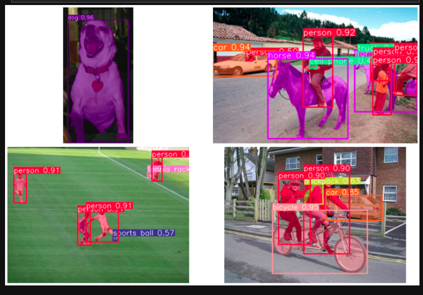

# YOLOv8-Object-Detection-Classification-Segmentation

Introducing Ultralytics YOLOv8, the latest version of the acclaimed real-time object detection and image segmentation model. YOLOv8 is built on cutting-edge advancements in deep learning and computer vision, offering unparalleled performance in terms of speed and accuracy. Its streamlined design makes it suitable for various applications and easily adaptable to different hardware platforms, from edge devices to cloud APIs.

Here, we use YOLOv8 in images to classify, detect and segment the images data.

